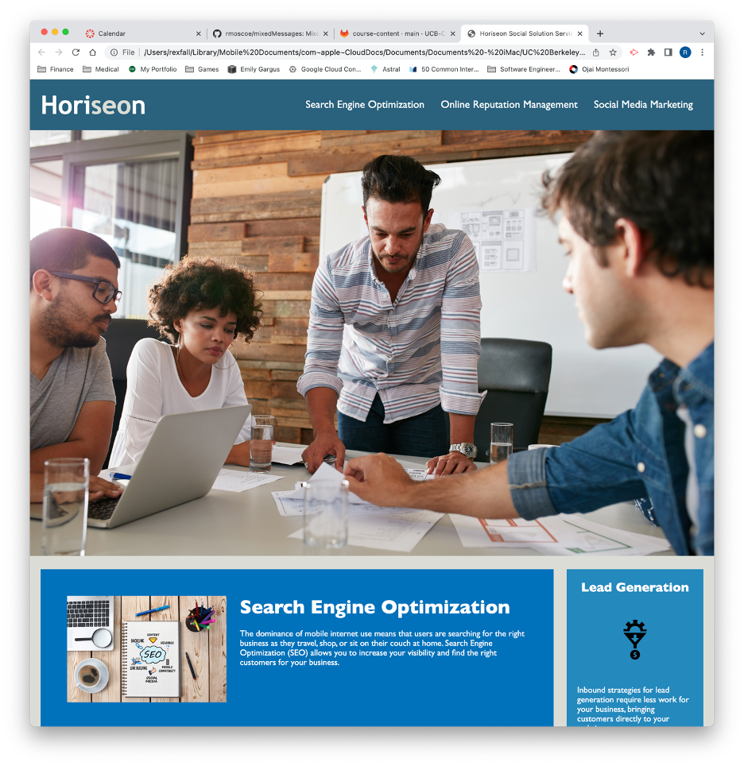
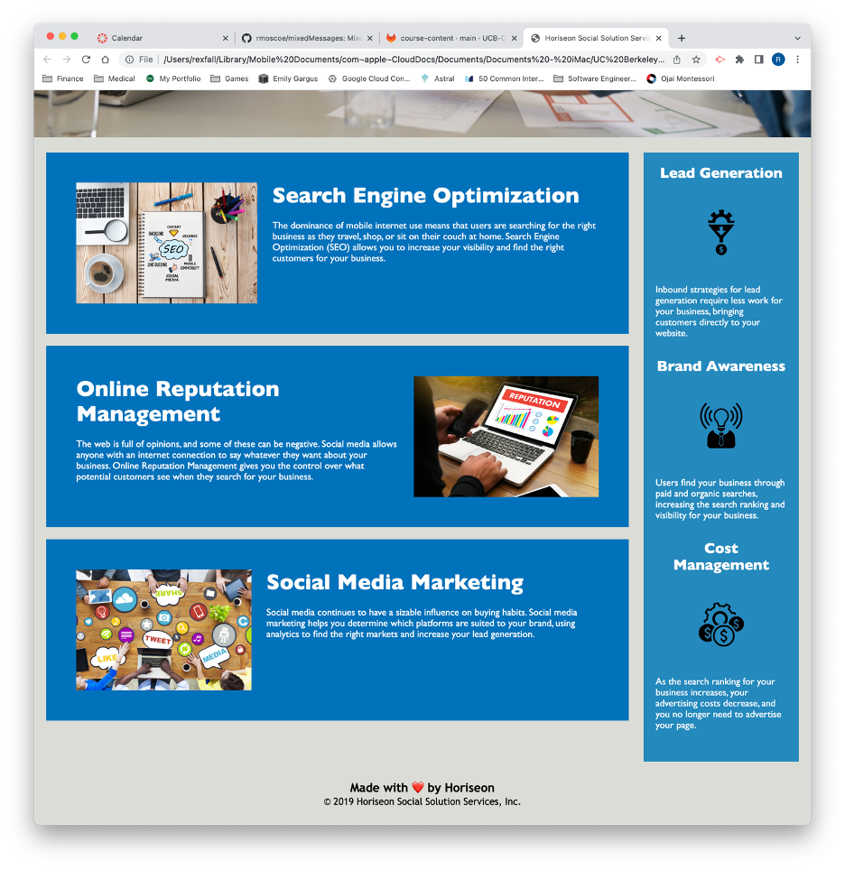

# Marketing Refactor

## Description 

Horiseon, a **fictitious** marketing agency, requested a refactoring of its website to improve accessibility. This project included the following improvements to the existing code:
* Replacement of non-semantic elements with semantic ones
* Adherence to a logical structure of elements independent of styling or positioning
* Addition of alt attributes for all images and icons
* Sequencing of headings
* Addition of a concise, descriptive title

This project uses the following technologies:
* HTML
* CSS

[View the live Horiseon site](https://rmoscoe.github.io/marketing-refactor/)

 

## Installation

N/A

## Credits

Starter code provided by Trilogy Education Services, LLC, a 2U, Inc. brand.